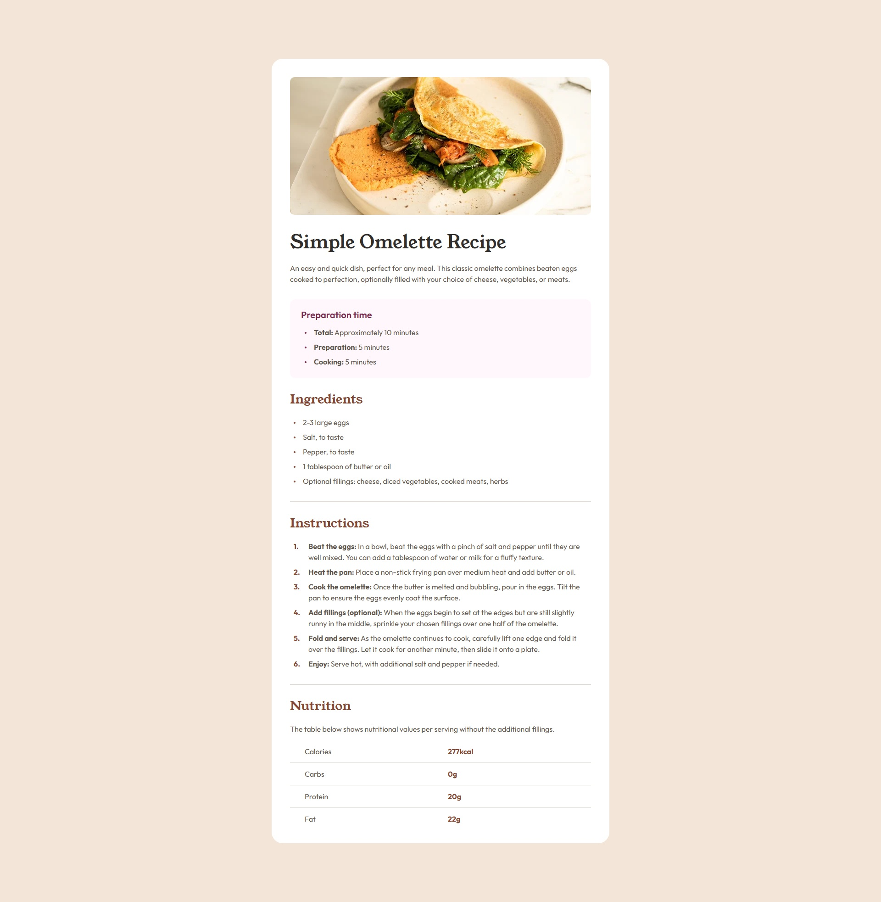

# Simple Omelette Recipe

This is a solution to the [Recipe page challenge on Frontend Mentor](https://www.frontendmentor.io/challenges/recipe-page-KiTsR8QQKm). Frontend Mentor challenges help you improve your coding skills by building realistic projects. 

## Table of contents

- [Overview](#overview)
  - [Screenshot](#screenshot)
  - [Links](#links)
- [My process](#my-process)
  - [Built with](#built-with)
  - [What I learned](#what-i-learned)
  - [Continued development](#continued-development)
- [Author](#author)

## Overview

### Screenshot



### Links

- Solution URL: [Frontend Mentor solution](https://www.frontendmentor.io/solutions/simple-omelette-recipe-semantic-html-css-variables-flexbox-and-open-DL6buH20WX)
- Live Site URL: [https://Dusha2.github.io/recipe_page/](https://Dusha2.github.io/recipe_page/)

## My process

### Built with

- Semantic HTML5 markup
- CSS custom properties (Variables)
- Flexbox
- Desktop-first workflow
- CSS Counters for custom list styling
- Open Graph Meta Tags for social media sharing
- Accessibility best practices (a11y)

### What I learned

During this project, I deepened my understanding of semantic HTML5, accessibility, and modern CSS techniques. 

One of the highlights was perfectly structuring the document using `<article>`, `<section>`, and `<hgroup>`, as well as managing screen-reader accessibility by hiding decorative elements:

```html
<hr aria-hidden="true">
```

I also learned how to use CSS counters to create beautifully styled, custom ordered lists without relying on default browser styling. This gave me full control over the numbers' color, font weight, and positioning:

```css
.instructions-list {
    padding: 0;
    counter-reset: instruction-counter;
}

.instructions-item {
    position: relative;
    counter-increment: instruction-counter;

    padding-left: 40px;
}

.instructions-item::before {
    content: counter(instruction-counter) ".";
    color: var(--color-brown);
    font-weight: 700;
    left: 8px;
    top: 0;
    position: absolute;
}
```

### Continued development

In future projects, I want to continue focusing on:
- Advanced accessibility techniques to make the web usable for everyone.
- SEO optimization and structured data.
- Exploring more complex CSS architectures and pseudo-elements.

## Author

- GitHub - [Roman Dushyn](https://github.com/Dusha2)
- Frontend Mentor - [@Dusha2](https://www.frontendmentor.io/profile/Dusha2)